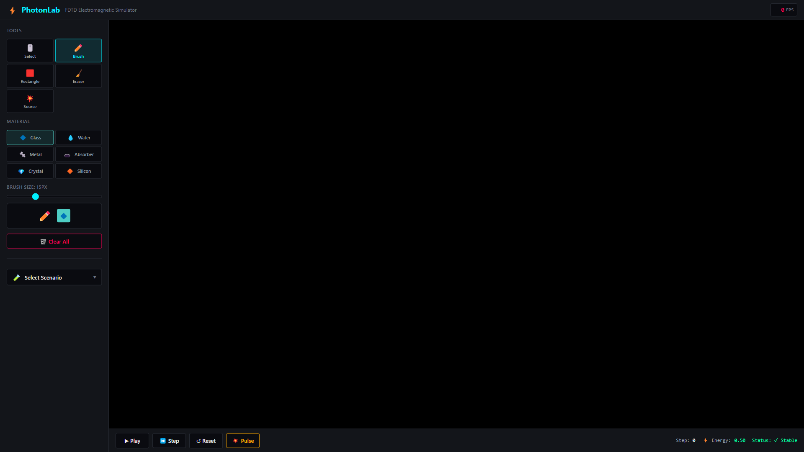
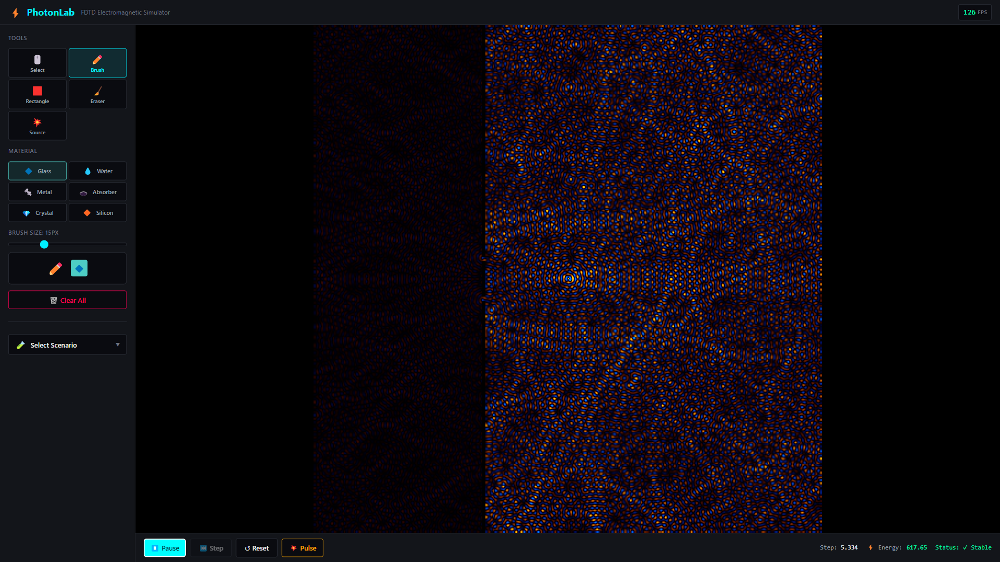

# PhotonLab: High-Performance FDTD Solver in Rust & WebAssembly

**PhotonLab** is an engineering-grade electromagnetic field simulator designed to run directly in modern web browsers. Unlike traditional physics engines that rely on server-side computation, PhotonLab executes the **Finite-Difference Time-Domain (FDTD)** method entirely on the client side using **WebAssembly** and **WebGL2**.

This project demonstrates how low-level systems programming (Rust) can be bridged with web technologies to visualize complex wave dynamics (refraction, interference, diffraction) at **60 FPS** on standard hardware.


---

## 🏗 System Architecture

The simulation pipeline is designed to minimize JavaScript overhead and maximize memory throughput.

### 1. The Physics Core (Rust + Wasm)

At the heart of the engine is a customized **Yee Lattice** implementation written in Rust.

- **Memory Layout:** Uses flat 1D arrays for 2D fields (`Ez`, `Hx`, `Hy`) to ensure cache locality and enable potential SIMD optimizations.
- **Boundaries:** Implements **CPML (Convolutional Perfectly Matched Layer)** to mathematically simulate infinite open space, absorbing outgoing waves without artificial reflections.
- **Stability:** Automatically enforces the Courant–Friedrichs–Lewy (CFL) condition to prevent numerical divergence.

### 2. Zero-Copy Rendering (WebGL2)

Visualizing 262,144 cells (512×512 grid) every 16ms requires bypassing the standard DOM.

- **Direct Memory Access:** Instead of copying data from Wasm to JS arrays (which causes GC pauses), the render engine passes a **raw pointer** from the Wasm linear memory directly to WebGL.
- **Texture Float:** The electromagnetic field data is uploaded as an `R32F` (32-bit floating point) texture.
- **Shading:** A custom fragment shader applies a "Viridis" or "Diverging" colormap and performs bilinear interpolation on the GPU.

---

## 🧪 Simulation Capabilities

This is not just a visualizer; it is a quantitative tool.

| Main Interface | Double Slit | Parabolic Reflector |
|:---:|:---:|:---:|
|  |  |  |

| Signal Monitor | Lens Focusing |
|:---:|:---:|
|  |  |

- **Wave Sources:** Plane Wave (Interference studies), Gaussian Pulse (Broadband analysis), Point Source.
- **Material System:** Modeling of dielectrics (Glass, Water), PEC (Perfect Electric Conductors), and custom refractive indices.
- **Preset Scenarios:** Double Slit, Parabolic Reflector, Lens Focusing, and Empty Canvas for custom experiments.
- **Real-time Telemetry:**
  - **Oscilloscope:** Probe specific grid points to analyze signal amplitude vs. time.
  - **Energy Monitor:** Tracks global system energy (ε|E|² + μ|H|²) to detect numerical instability (NaN/Infinity).

---

## 🚀 Quick Start

**Prerequisites:** Rust (`cargo`, `wasm-pack`) and Node.js.

```bash
# 1. Build the Physics Engine
cd rust-core
wasm-pack build --target web

# 2. Launch the Interface
cd ../web
npm install
npm run dev
```

Open http://localhost:5173 in your browser.

---

## 📁 Project Structure

```
PhotonLab/
├── rust-core/              # Wasm physics engine
│   ├── src/
│   │   ├── fdtd.rs         # Yee algorithm core
│   │   ├── cpml.rs         # CPML boundary layer
│   │   ├── materials.rs    # Material definitions
│   │   ├── scenarios.rs    # Preset experiments
│   │   └── sources.rs      # Wave source types
│   └── pkg/                # Compiled wasm output
└── web/                    # React frontend
    ├── src/
    │   ├── components/     # UI components
    │   ├── shaders/        # WebGL shaders
    │   └── hooks/          # useSimulation hook
    └── scripts/
        └── capture.js      # Automated screenshot bot
```

---

## 📸 Automated Screenshots

Generate documentation screenshots with Puppeteer:

```bash
cd web
npm run capture
```

---

## 📚 Technical References

- *Computational Electrodynamics: The Finite-Difference Time-Domain Method*, Taflove & Hagness.
- *Theory and Computation of Electromagnetic Fields*, Jin.

---

Built for the open-source scientific community.
