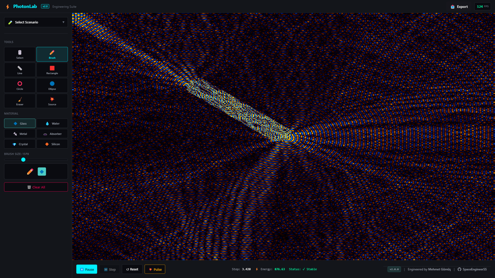
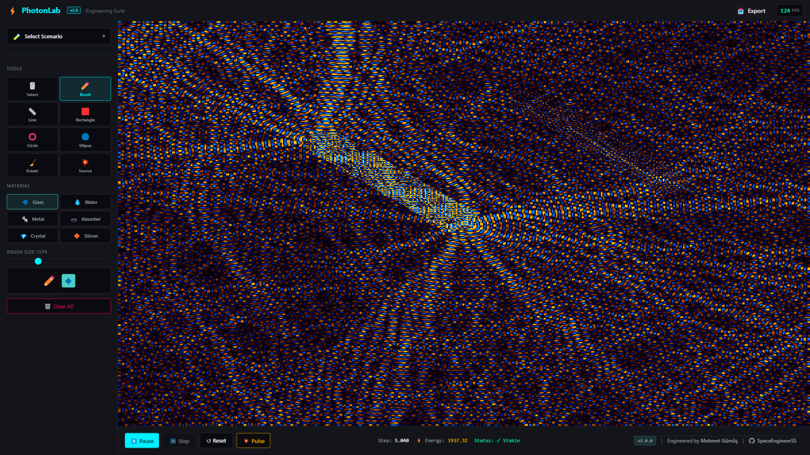
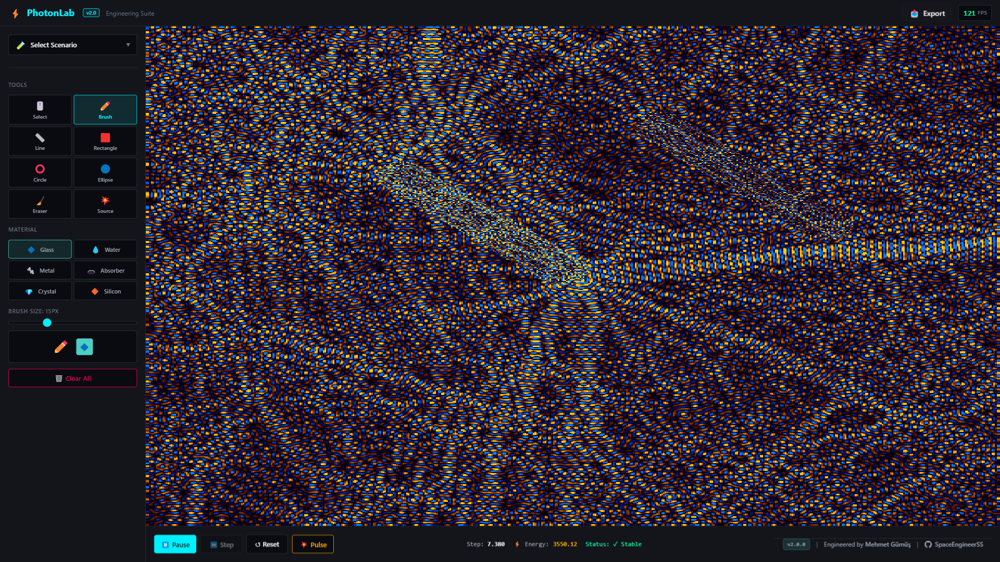

# ⚡ PhotonLab v2.0: Engineering Suite

<div align="center">
  
  <br/><br/>
  
  [](https://www.rust-lang.org/)
  [](https://webassembly.org/)
  [](https://react.dev/)
  [](LICENSE)
</div>

**PhotonLab** is a high-performance, browser-based electromagnetic simulation environment engineered for physics research and education. It solves **Maxwell's Equations** in real-time using the Finite-Difference Time-Domain (FDTD) method, accelerated by WebAssembly and WebGL2.

> **Engineered by [Mehmet Gümüş](https://github.com/SpaceEngineerSS)**

---

## 🔬 v2.0 Engineering Features

### 1. Interactive CAD Engine
Design your own experiments. Use the **Brush, Line, Circle, and Ellipse** tools to paint dielectric materials (εᵣ), conductors (PEC), and absorbers directly onto the simulation grid.

* **Touch Support:** Fully responsive drawing on tablets/mobile.
* **SVG Overlay:** Precision preview before committing changes to the FDTD grid.
* **Material Library:** Glass, Water, Diamond, Metal, Silicon with accurate permittivity values.

### 2. Advanced Signal Analysis (FFT)
Beyond time-domain monitoring, PhotonLab v2.0 includes a real-time **Spectrum Analyzer**.

* **Fast Fourier Transform:** Powered by `rustfft` for high-performance spectral decomposition.
* **Hann Windowing:** Reduces spectral leakage for accurate frequency detection.
* **Peak Detection:** Automatically identifies dominant frequency components.

### 3. Phased Array & Beamforming
Simulate advanced antenna systems with the new **Source Inspector**.

* **Phased Arrays:** Control phase offsets (φ) to steer beams electronically.
* **Gaussian Beams:** Model laser propagation with spatial intensity profiles.
* **Multi-Element Sources:** Create custom antenna configurations.

### 4. Professional Output
* **Video Export:** Record simulation clips (.webm) directly from the browser.
* **Snapshot:** Generate watermarked, high-resolution engineering screenshots.
* **CSV Export:** Extract time-series probe data for external analysis.

---

## 📸 Gallery

| **Engineering Dashboard** | **CAD Interaction** |
|:---:|:---:|
|  |  |
| *Professional simulation workspace* | *Real-time structure design* |

| **Rectangle Tool** | **Wave Interference** |
|:---:|:---:|
|  |  |
| *Precision CAD shapes* | *Complex wave patterns* |

---

## 🛠️ Architecture

PhotonLab uses a **hybrid architecture** to achieve native performance in the browser:

```
┌─────────────────────────────────────────────────────────────┐
│                    React/TypeScript UI                       │
│  ┌─────────────┐  ┌─────────────┐  ┌─────────────────────┐  │
│  │  Sidebar    │  │  SimCanvas  │  │  DataPanel          │  │
│  │  - Toolbar  │  │  (WebGL2)   │  │  - SignalMonitor    │  │
│  │  - Scenarios│  │             │  │  - SpectrumMonitor  │  │
│  └─────────────┘  └─────────────┘  └─────────────────────┘  │
└─────────────────────────────────────────────────────────────┘
                              │
                    Zero-Copy Memory Access
                              │
┌─────────────────────────────────────────────────────────────┐
│                    Rust/WebAssembly Core                     │
│  ┌─────────────┐  ┌─────────────┐  ┌─────────────────────┐  │
│  │  fdtd.rs    │  │  sources.rs │  │  spectrum.rs        │  │
│  │  Yee Lattice│  │  PhasedArray│  │  FFT (rustfft)      │  │
│  │  CPML ABC   │  │  Gaussian   │  │  Hann Windowing     │  │
│  └─────────────┘  └─────────────┘  └─────────────────────┘  │
└─────────────────────────────────────────────────────────────┘
```

### Key Technologies

| Component | Technology | Purpose |
|-----------|------------|---------|
| Physics Core | Rust + wasm-pack | FDTD solver, FFT analysis |
| Rendering | WebGL2 + GLSL | Real-time field visualization |
| Interface | React + TypeScript | Engineering dashboard |
| State | Zustand | Efficient state management |
| Build | Vite + PWA | Installable web application |

---

## 🚀 Quick Start

### Prerequisites
- [Rust](https://rustup.rs/) with `wasm32-unknown-unknown` target
- [wasm-pack](https://rustwasm.github.io/wasm-pack/installer/)
- [Node.js](https://nodejs.org/) v18+

### Installation

```bash
# 1. Clone the repository
git clone https://github.com/SpaceEngineerSS/PhotonLab.git
cd PhotonLab

# 2. Build the Rust Core
cd rust-core
wasm-pack build --target web

# 3. Launch the Interface
cd ../web
npm install
npm run dev
```

Open [http://localhost:5173](http://localhost:5173) in your browser.

---

## ⌨️ Keyboard Shortcuts

| Key | Action |
|-----|--------|
| `Space` | Play/Pause simulation |
| `R` | Reset simulation |
| `B` | Brush tool |
| `R` | Rectangle tool |
| `C` | Circle tool |
| `O` | Ellipse tool |
| `L` | Line tool |
| `E` | Eraser |
| `S` | Source placement |
| `P` | Probe (select) |

---

## 📖 Physics Background

PhotonLab implements the **Finite-Difference Time-Domain (FDTD)** method, a numerical approach to solving Maxwell's equations:

$$\nabla \times \mathbf{E} = -\mu \frac{\partial \mathbf{H}}{\partial t}$$

$$\nabla \times \mathbf{H} = \varepsilon \frac{\partial \mathbf{E}}{\partial t} + \sigma \mathbf{E}$$

The simulation uses the **Yee lattice** discretization scheme with:
- **Courant-Friedrichs-Lewy (CFL)** stability condition
- **Convolutional Perfectly Matched Layer (CPML)** absorbing boundaries
- **Real-time material editing** with permittivity updates

---

## 🤝 Contributing

Contributions are welcome! Please feel free to submit a Pull Request.

1. Fork the repository
2. Create your feature branch (`git checkout -b feature/AmazingFeature`)
3. Commit your changes (`git commit -m 'Add some AmazingFeature'`)
4. Push to the branch (`git push origin feature/AmazingFeature`)
5. Open a Pull Request

---

## � License

This project is licensed under the MIT License - see the [LICENSE](LICENSE) file for details.

---

<div align="center">
  <br/>
  <sub>Engineered with 💙 by <a href="https://github.com/SpaceEngineerSS">Mehmet Gümüş</a></sub>
  <br/><br/>
  <a href="https://github.com/SpaceEngineerSS/PhotonLab">
    
  </a>
</div>
